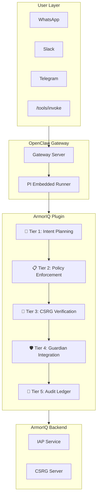
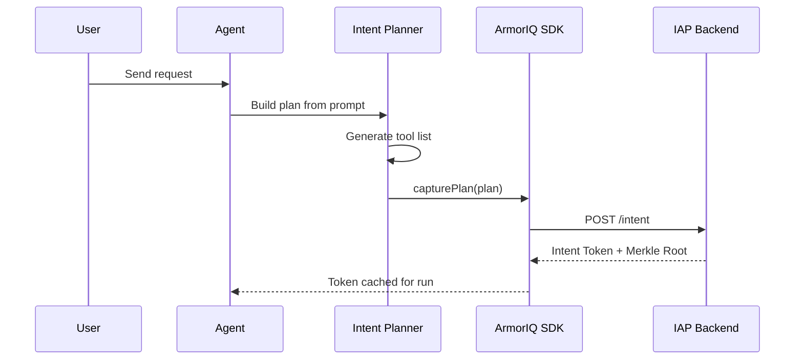
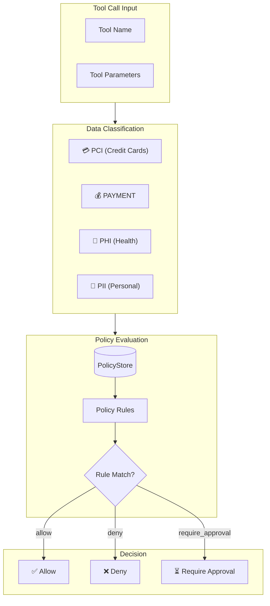
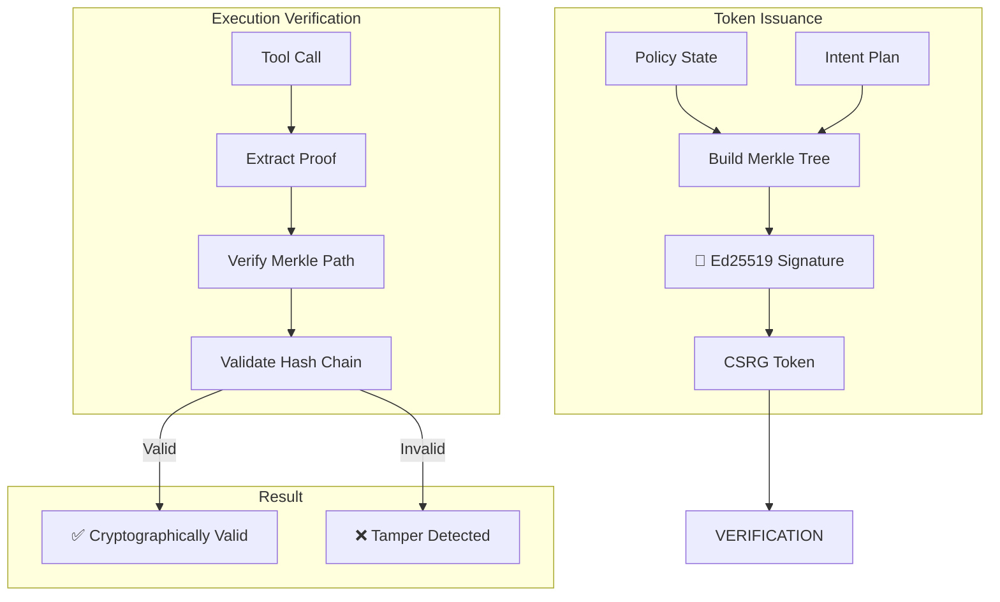
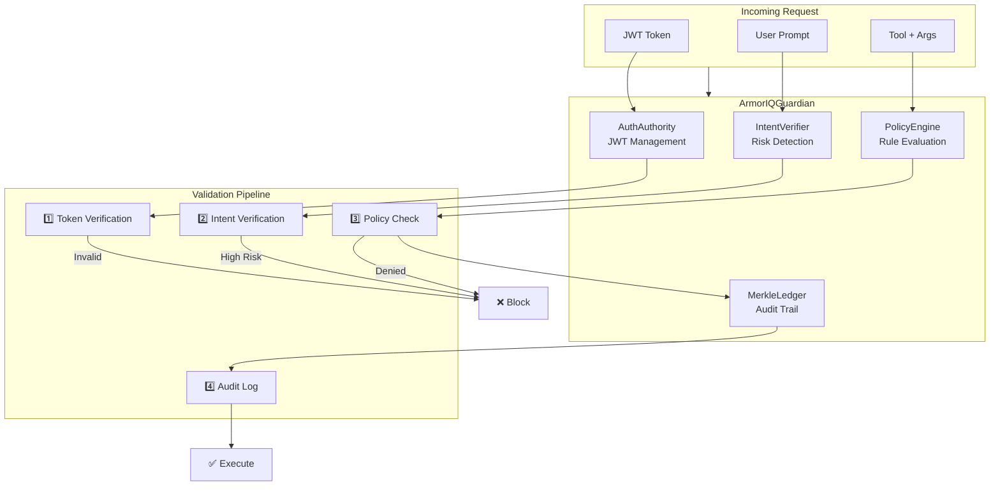
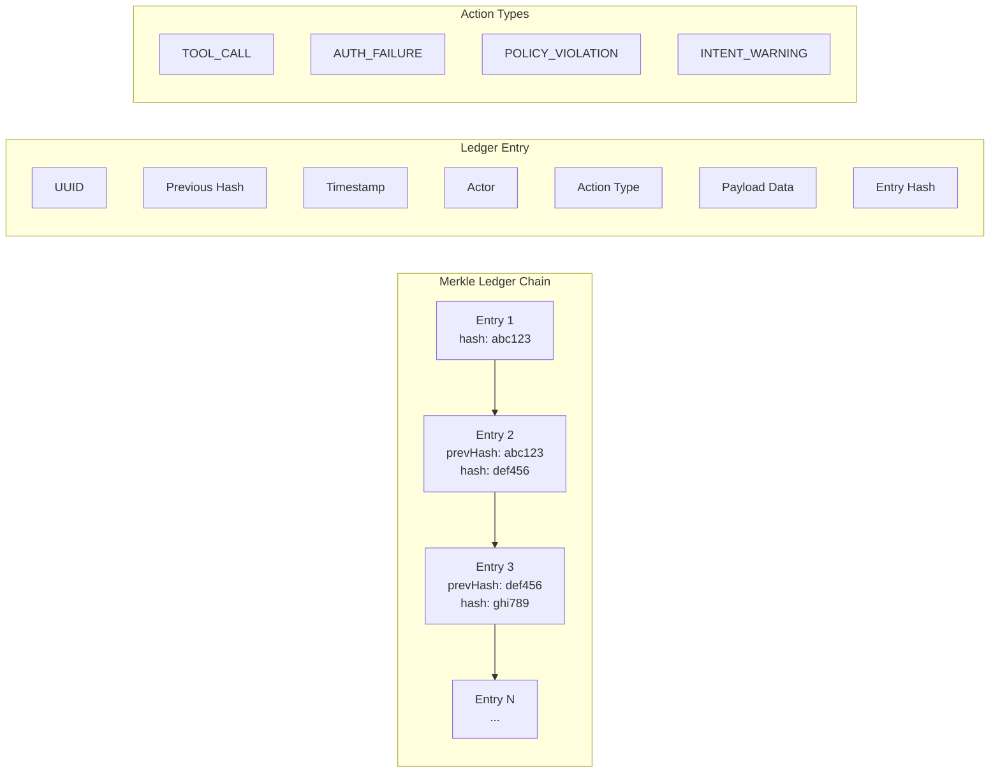
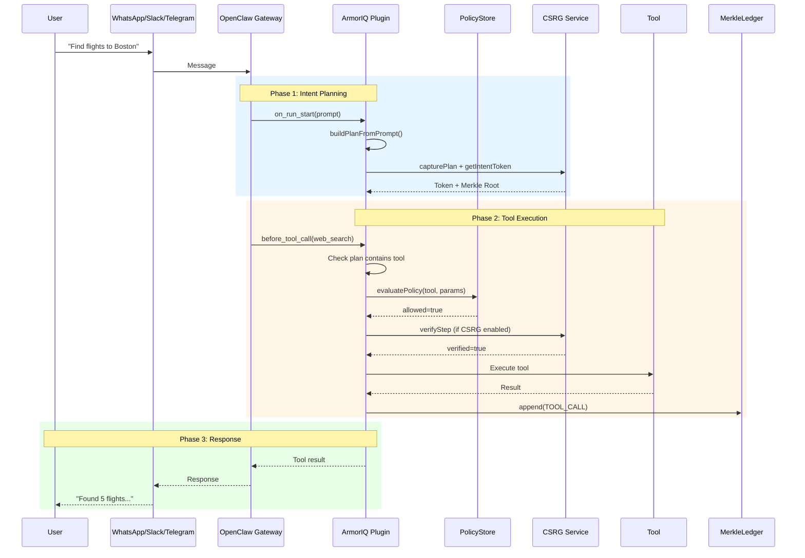
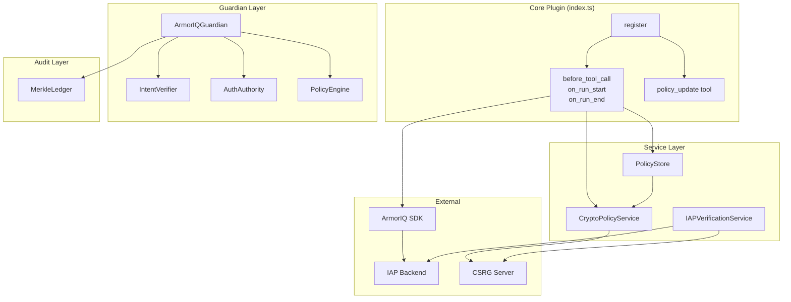

# ArmorIQ Architecture Documentation

## Overview

ArmorIQ is an **intent-security integration layer** that provides a comprehensive security framework for AI agent tool execution. It implements a **5-tiered security architecture** that ensures every tool call is:
1. **Planned** - Captured in an explicit intent plan
2. **Policy-checked** - Evaluated against configurable rules
3. **Cryptographically verified** - Secured via CSRG Merkle proofs
4. **Guardian-protected** - Integrated security orchestration
5. **Audit-logged** - Recorded in an immutable ledger

---

## High-Level System Architecture



---

## The 5-Tiered Security Architecture

ArmorIQ implements a **fail-closed, defense-in-depth** security model where each tier adds an additional layer of protection.

```mermaid
graph LR
    subgraph Tier1["Tier 1: Intent Planning"]
        IP[buildPlanFromPrompt]
        IC[capturePlan]
        IT[getIntentToken]
    end

    subgraph Tier2["Tier 2: Policy Enforcement"]
        PS[PolicyStore]
        PE[evaluatePolicy]
        DC[detectDataClasses]
    end

    subgraph Tier3["Tier 3: CSRG Verification"]
        CPS[CryptoPolicyService]
        IVS[IAPVerificationService]
        MP[Merkle Proofs]
    end

    subgraph Tier4["Tier 4: Guardian Integration"]
        AG[ArmorIQGuardian]
        IV[IntentVerifier]
        AA[AuthAuthority]
    end

    subgraph Tier5["Tier 5: Audit Ledger"]
        ML[MerkleLedger]
        WAL[Write-Ahead Log]
        INT[Integrity Verification]
    end

    Tier1 --> Tier2 --> Tier3 --> Tier4 --> Tier5
```



---

### Tier 1: Intent Planning Layer

**Purpose**: Capture the user's intent before any tool execution occurs.



**Key Components**:

| Component | File | Description |
|-----------|------|-------------|
| `buildPlanFromPrompt` | [index.ts](file:///c:/Users/soman/OneDrive/Coding/ArmorIQ/aiq-openclaw/extensions/armoriq/index.ts#L1050-L1157) | Uses LLM to generate a JSON plan from user prompt |
| `ArmorIQClient` | SDK | Captures plan and obtains intent tokens from IAP |
| `planCache` | [index.ts](file:///c:/Users/soman/OneDrive/Coding/ArmorIQ/aiq-openclaw/extensions/armoriq/index.ts#L119) | Per-run cache for plan/token pairs |

**Plan Schema**:
```json
{
  "steps": [
    {
      "action": "tool_name",
      "mcp": "openclaw",
      "description": "optional",
      "metadata": { "inputs": {} }
    }
  ],
  "metadata": { "goal": "user's goal" }
}
```

---

### Tier 2: Policy Enforcement Layer

**Purpose**: Evaluate tool calls against configurable security rules with data classification.



**Key Components**:

| Component | File | Description |
|-----------|------|-------------|
| `PolicyStore` | [policy.ts](file:///c:/Users/soman/OneDrive/Coding/ArmorIQ/aiq-openclaw/extensions/armoriq/src/policy.ts#L305-L492) | Persistent policy storage with versioning and history |
| `evaluatePolicy` | [policy.ts](file:///c:/Users/soman/OneDrive/Coding/ArmorIQ/aiq-openclaw/extensions/armoriq/src/policy.ts#L232-L284) | Evaluates tool calls against policy rules |
| `detectDataClasses` | [policy.ts](file:///c:/Users/soman/OneDrive/Coding/ArmorIQ/aiq-openclaw/extensions/armoriq/src/policy.ts#L215-L230) | Automatically classifies sensitive data |
| `PolicyEngine` | [policy-engine.ts](file:///c:/Users/soman/OneDrive/Coding/ArmorIQ/aiq-openclaw/extensions/armoriq/src/policy-engine.ts#L74-L266) | Advanced rule engine with conditions |

**Policy Rule Actions**:
- `allow` - Permit tool execution
- `deny` - Block tool execution
- `require_approval` - Pause for user approval

**Data Classes**:
- **PCI** - Credit card numbers (Luhn-validated)
- **PAYMENT** - Financial/billing terms
- **PHI** - Health/medical information
- **PII** - Personal identifiable information

---

### Tier 3: CSRG Cryptographic Verification Layer

**Purpose**: Provide cryptographic guarantees through Merkle tree proofs.



**Key Components**:

| Component | File | Description |
|-----------|------|-------------|
| `CryptoPolicyService` | [crypto-policy.service.ts](file:///c:/Users/soman/OneDrive/Coding/ArmorIQ/aiq-openclaw/extensions/armoriq/src/crypto-policy.service.ts#L149-L355) | Issues CSRG tokens with embedded policy |
| `IAPVerificationService` | [iap-verfication.service.ts](file:///c:/Users/soman/OneDrive/Coding/ArmorIQ/aiq-openclaw/extensions/armoriq/src/iap-verfication.service.ts#L164-L342) | Verifies steps against IAP backend |
| `computePolicyDigest` | [crypto-policy.service.ts](file:///c:/Users/soman/OneDrive/Coding/ArmorIQ/aiq-openclaw/extensions/armoriq/src/crypto-policy.service.ts#L133-L147) | SHA-256 hash of policy rules |

**CSRG Verification Flow**:
1. Policy embedded in Merkle tree at token issuance
2. Each tool step gets a cryptographic proof
3. At execution, proof is validated against Merkle root
4. Tampering detected if hash chain broken

---

### Tier 4: Guardian Integration Layer

**Purpose**: Central orchestration of all security components.



**Key Components**:

| Component | File | Description |
|-----------|------|-------------|
| `ArmorIQGuardian` | [guardian-integration.ts](file:///c:/Users/soman/OneDrive/Coding/ArmorIQ/aiq-openclaw/extensions/armoriq/src/guardian-integration.ts#L30-L233) | Main orchestration class |
| `IntentVerifier` | [intent-verifier.ts](file:///c:/Users/soman/OneDrive/Coding/ArmorIQ/aiq-openclaw/extensions/armoriq/src/intent-verifier.ts#L19-L145) | Detects intent mismatches |
| `AuthAuthority` | [auth-authority.ts](file:///c:/Users/soman/OneDrive/Coding/ArmorIQ/aiq-openclaw/extensions/armoriq/src/auth-authority.ts) | JWT token signing/verification |

**Intent Verification Heuristics**:
- **Financial Risk Detection**: Flags financial tools without explicit user authorization
- **Dangerous Phrase Detection**: Catches override/bypass attempts
- **High-Risk Verbs**: buy, purchase, pay, transfer, delete, etc.

---

### Tier 5: Audit Ledger Layer

**Purpose**: Immutable, tamper-evident logging with cryptographic integrity.



**Key Components**:

| Component | File | Description |
|-----------|------|-------------|
| `MerkleLedger` | [ledger.ts](file:///c:/Users/soman/OneDrive/Coding/ArmorIQ/aiq-openclaw/extensions/armoriq/src/ledger.ts#L56-L274) | Cryptographic ledger implementation |
| Write-Ahead Log | [ledger.ts](file:///c:/Users/soman/OneDrive/Coding/ArmorIQ/aiq-openclaw/extensions/armoriq/src/ledger.ts#L114-L127) | Crash recovery mechanism |
| Integrity Verification | [ledger.ts](file:///c:/Users/soman/OneDrive/Coding/ArmorIQ/aiq-openclaw/extensions/armoriq/src/ledger.ts#L209-L243) | Detects chain tampering |

**Features**:
- **Write-Ahead Logging**: Persists to disk before acknowledgment
- **Hash Chain**: Each entry hash includes previous entry hash
- **Integrity Check**: Re-compute all hashes to detect tampering
- **Query Support**: Filter by action, actor, or time range

---

## Complete Request Flow



---

## Component Interaction Map



---

## Security Guarantees

| Guarantee | Mechanism | Tier |
|-----------|-----------|------|
| **Intent Drift Prevention** | Plan allowlist enforcement | Tier 1 |
| **Fail-Closed Enforcement** | Block on missing plan/token | Tier 1 |
| **Data Classification** | Automatic PCI/PII/PHI detection | Tier 2 |
| **Policy Versioning** | History with audit trail | Tier 2 |
| **Cryptographic Proof** | Merkle tree + Ed25519 | Tier 3 |
| **Tamper Detection** | Hash chain verification | Tier 3, 5 |
| **Financial Protection** | High-risk intent detection | Tier 4 |
| **Immutable Audit** | Write-ahead ledger | Tier 5 |

---

## Configuration Reference

```yaml
plugins:
  entries:
    armoriq:
      enabled: true
      
      # Tier 1: Intent Planning
      validitySeconds: 60
      
      # Tier 2: Policy Enforcement  
      policyStorePath: "./armoriq.policy.json"
      policyUpdateEnabled: true
      policyUpdateAllowList: ["+15550001111"]
      
      # Tier 3: CSRG Verification
      cryptoPolicyEnabled: true
      csrgEndpoint: "http://localhost:8000"
      
      # Tier 4: Guardian
      iapEndpoint: "https://customer-iap.armoriq.ai"
      proxyEndpoint: "https://customer-proxy.armoriq.ai"
      backendEndpoint: "https://customer-api.armoriq.ai"
```

---

## File Structure

```
extensions/armoriq/
├── index.ts                    # Main plugin (1944 lines)
├── index.test.ts              # Plugin tests
├── ARCHITECTURE.md            # This document
├── README.md                  # Quick start guide
├── openclaw.plugin.json       # Plugin manifest
├── package.json
├── policies/
│   └── healthcare.json        # Example policies
├── logs/
│   └── guardian_audit.log     # Audit log output
└── src/
    ├── auth-authority.ts      # JWT management
    ├── crypto-policy.service.ts # CSRG token issuance
    ├── guardian-integration.ts  # Central orchestration
    ├── guardian-proxy.ts       # HTTP proxy layer
    ├── guardian-schemas.ts     # Type definitions
    ├── iap-verfication.service.ts # IAP verification
    ├── intent-verifier.ts      # Intent mismatch detection
    ├── ledger.ts               # Merkle ledger
    ├── policy-engine.ts        # Advanced rule engine
    ├── policy.ts               # Policy store & evaluation
    └── test-*.ts               # Test files
```

---

## Related Documentation

- [AIQREADME.md](file:///c:/Users/soman/OneDrive/Coding/ArmorIQ/aiq-openclaw/AIQREADME.md) - Integration guide and demo runbook
- [armoriq.policy.json](file:///c:/Users/soman/OneDrive/Coding/ArmorIQ/aiq-openclaw/armoriq.policy.json) - Current policy state
- [openclaw.plugin.json](file:///c:/Users/soman/OneDrive/Coding/ArmorIQ/aiq-openclaw/extensions/armoriq/openclaw.plugin.json) - Plugin configuration schema
