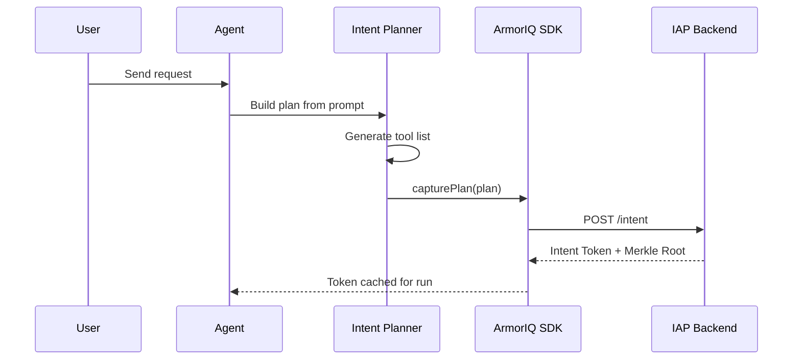
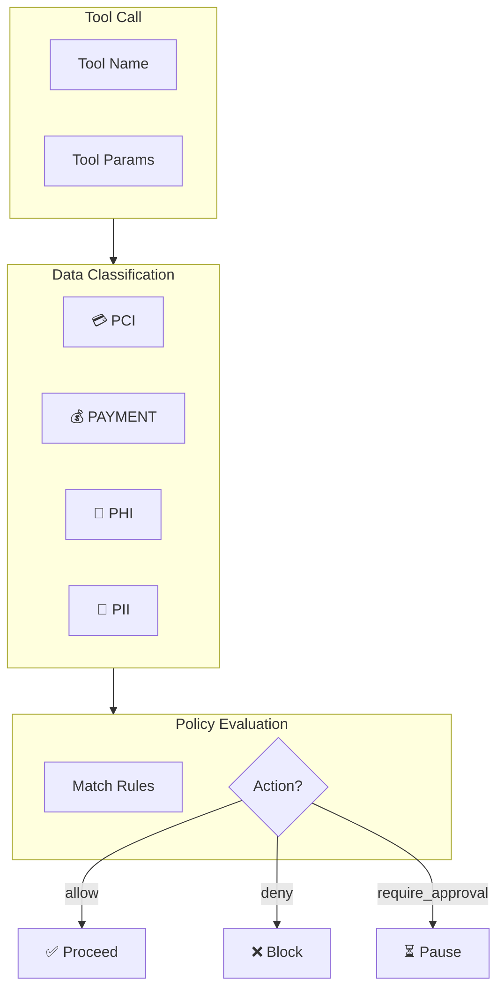
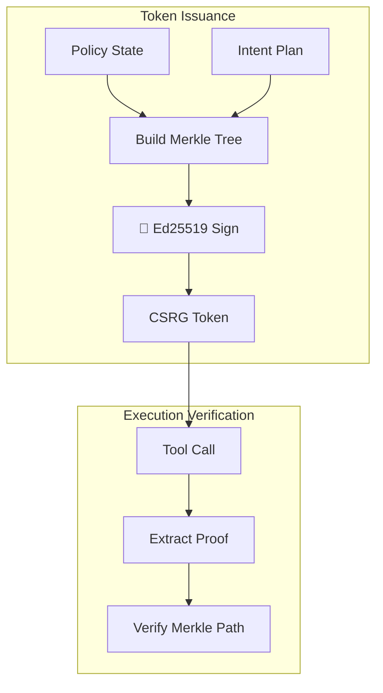

# ArmorIQ Architecture

> **Deep dive into the 5-tier security architecture**

## Overview

ArmorIQ implements a **defense-in-depth** security model with 5 distinct tiers. Each tier adds an additional layer of protection, and all tiers must pass for a tool call to execute.

```
┌─────────────────────────────────────────────────────────────┐
│                     User Request                             │
└──────────────────────────┬──────────────────────────────────┘
                           │
                           ▼
┌─────────────────────────────────────────────────────────────┐
│  Tier 1: INTENT PLANNING                                    │
│  ━━━━━━━━━━━━━━━━━━━━━━━                                    │
│  • Build explicit plan from user prompt                     │
│  • Capture plan with ArmorIQ SDK                            │
│  • Obtain cryptographic intent token                        │
│  • Cache plan for the run duration                          │
└──────────────────────────┬──────────────────────────────────┘
                           │
                           ▼
┌─────────────────────────────────────────────────────────────┐
│  Tier 2: POLICY ENFORCEMENT                                 │
│  ━━━━━━━━━━━━━━━━━━━━━━━━━                                  │
│  • Evaluate tool against policy rules                       │
│  • Detect sensitive data (PCI, PII, PHI, PAYMENT)           │
│  • Apply allow/deny/require_approval actions                │
│  • Version-controlled policy with audit history             │
└──────────────────────────┬──────────────────────────────────┘
                           │
                           ▼
┌─────────────────────────────────────────────────────────────┐
│  Tier 3: CSRG VERIFICATION                                  │
│  ━━━━━━━━━━━━━━━━━━━━━━━━                                   │
│  • Verify Merkle proofs for each step                       │
│  • Validate policy digest matches token                     │
│  • Ed25519 signature verification                           │
│  • Tamper detection via hash chain                          │
└──────────────────────────┬──────────────────────────────────┘
                           │
                           ▼
┌─────────────────────────────────────────────────────────────┐
│  Tier 4: GUARDIAN INTEGRATION                               │
│  ━━━━━━━━━━━━━━━━━━━━━━━━━━                                 │
│  • Central security orchestration                           │
│  • Intent mismatch detection                                │
│  • JWT token management                                     │
│  • High-risk action detection                               │
└──────────────────────────┬──────────────────────────────────┘
                           │
                           ▼
┌─────────────────────────────────────────────────────────────┐
│  Tier 5: AUDIT LEDGER                                       │
│  ━━━━━━━━━━━━━━━━━━━━                                       │
│  • Immutable cryptographic ledger                           │
│  • Write-ahead logging (WAL)                                │
│  • Hash chain linking entries                               │
│  • Integrity verification                                   │
└──────────────────────────┬──────────────────────────────────┘
                           │
                           ▼
                    ✅ Tool Executes
                         or
                    ❌ Blocked
```

---

## Tier 1: Intent Planning

**Purpose**: Capture the user's intent before any tool execution.

### Flow



### Key Components

| Component | Location | Purpose |
|-----------|----------|---------|
| `buildPlanFromPrompt()` | `index.ts:1050-1157` | LLM-based plan generation |
| `ArmorIQClient` | `@armoriq/sdk` | SDK for IAP communication |
| `planCache` | `index.ts:119` | Per-run plan/token cache |

### Plan Schema

```json
{
  "steps": [
    {
      "action": "tool_name",
      "mcp": "openclaw",
      "description": "What this step does",
      "metadata": { "inputs": {} }
    }
  ],
  "metadata": {
    "goal": "User's goal",
    "policy_hash": "sha256...",
    "policy_version": 1
  }
}
```

### Enforcement

- **Intent Drift**: Tools not in the plan are blocked
- **Token Expiry**: Tool calls blocked after token expires
- **Fail-Closed**: Missing plan/token blocks execution

---

## Tier 2: Policy Enforcement

**Purpose**: Evaluate tool calls against configurable security rules.

### Flow



### Key Components

| Component | Location | Purpose |
|-----------|----------|---------|
| `PolicyStore` | `src/policy.ts:305-492` | Persistent policy storage |
| `evaluatePolicy()` | `src/policy.ts:232-284` | Rule evaluation |
| `detectDataClasses()` | `src/policy.ts:215-230` | Automatic data classification |

### Policy Rule Structure

```typescript
interface PolicyRule {
  id: string;                          // e.g., "policy1"
  action: "allow" | "deny" | "require_approval";
  tool: string;                        // Tool name or "*"
  dataClass?: "PCI" | "PAYMENT" | "PHI" | "PII";
  params?: Record<string, unknown>;    // Optional param constraints
  scope?: "org" | "project" | "run";
}
```

### Data Classification

| Class | Detection |
|-------|-----------|
| **PCI** | Credit card numbers (Luhn-validated) |
| **PAYMENT** | Financial keywords: bank, invoice, payment |
| **PHI** | Health/medical terms: patient, diagnosis |
| **PII** | Personal data: SSN, email patterns |

---

## Tier 3: CSRG Verification

**Purpose**: Cryptographic guarantees via Merkle tree proofs.

### Flow



### Key Components

| Component | Location | Purpose |
|-----------|----------|---------|
| `CryptoPolicyService` | `src/crypto-policy.service.ts:149-355` | Token issuance |
| `IAPVerificationService` | `src/iap-verfication.service.ts:164-342` | Step verification |
| `computePolicyDigest()` | `src/crypto-policy.service.ts:133-147` | Policy hashing |

### Verification Steps

1. Policy rules hashed into Merkle tree at token issuance
2. Each plan step receives a cryptographic proof
3. At execution, proof validated against Merkle root
4. Policy digest compared to detect tampering

---

## Tier 4: Guardian Integration

**Purpose**: Central orchestration of all security components.

### Components

```
┌─────────────────────────────────────────┐
│            ArmorIQGuardian              │
│  ┌─────────────────────────────────┐    │
│  │      AuthAuthority              │    │
│  │      JWT token management       │    │
│  └─────────────────────────────────┘    │
│  ┌─────────────────────────────────┐    │
│  │      IntentVerifier             │    │
│  │      Risk detection             │    │
│  └─────────────────────────────────┘    │
│  ┌─────────────────────────────────┐    │
│  │      PolicyEngine               │    │
│  │      Advanced rule evaluation   │    │
│  └─────────────────────────────────┘    │
│  ┌─────────────────────────────────┐    │
│  │      MerkleLedger               │    │
│  │      Audit logging              │    │
│  └─────────────────────────────────┘    │
└─────────────────────────────────────────┘
```

### Key Components

| Component | Location | Purpose |
|-----------|----------|---------|
| `ArmorIQGuardian` | `src/guardian-integration.ts:30-233` | Main orchestrator |
| `IntentVerifier` | `src/intent-verifier.ts:19-145` | Intent analysis |
| `AuthAuthority` | `src/auth-authority.ts` | JWT management |

### Intent Verification Heuristics

- **Financial Risk**: Flags spend/transfer without explicit authorization
- **Dangerous Phrases**: Detects jailbreak attempts ("ignore safety")
- **High-Risk Verbs**: buy, purchase, pay, transfer, delete

---

## Tier 5: Audit Ledger

**Purpose**: Immutable, tamper-evident logging.

### Structure

```
Entry 1          Entry 2          Entry 3
┌────────┐      ┌────────┐       ┌────────┐
│ hash   │──────│prevHash│───────│prevHash│
│ abc123 │      │ abc123 │       │ def456 │
│        │      │ hash   │       │ hash   │
│        │      │ def456 │       │ ghi789 │
└────────┘      └────────┘       └────────┘
```

### Key Components

| Component | Location | Purpose |
|-----------|----------|---------|
| `MerkleLedger` | `src/ledger.ts:56-274` | Ledger implementation |
| WAL | `src/ledger.ts:114-127` | Crash recovery |
| Integrity Check | `src/ledger.ts:209-243` | Tamper detection |

### Ledger Entry Fields

```typescript
interface LedgerEntry {
  id: string;           // UUID
  previousHash: string; // Link to previous entry
  timestamp: number;    // Unix timestamp
  actor: string;        // Who performed action
  action: string;       // TOOL_CALL, AUTH_FAILURE, etc.
  payload: object;      // Action details
  hash: string;         // Entry hash
}
```

### Action Types

| Action | Description |
|--------|-------------|
| `TOOL_CALL` | Successful tool execution |
| `AUTH_FAILURE` | Invalid/expired token |
| `POLICY_VIOLATION` | Policy rule blocked |
| `INTENT_WARNING` | Intent mismatch detected |

---

## OpenClaw Integration

ArmorIQ integrates with OpenClaw through the plugin system:

### Registration

```typescript
// extensions/armoriq/index.ts
export default function register(api: OpenClawPluginApi) {
  // Register hooks
  api.on("before_agent_start", async (event, ctx) => { ... });
  api.on("before_tool_call", async (event, ctx) => { ... });
  api.on("agent_end", async (event, ctx) => { ... });
  
  // Register tools
  api.registerTool(policyUpdateTool);
}
```

### Hook Integration

```typescript
// src/agents/pi-tools.before-tool-call.ts
import { proxy as guardianProxy } from "extensions/armoriq/src/guardian-proxy.js";

// Called before every tool execution
await guardianProxy.validateAndLog({
  token: resolvedToken,
  tool: toolName,
  args: params,
  prompt: userPrompt,
});
```

---

## Security Guarantees

| Guarantee | Mechanism | Tier |
|-----------|-----------|------|
| Intent Drift Prevention | Plan allowlist | 1 |
| Fail-Closed Enforcement | Block on missing plan | 1 |
| Data Classification | PCI/PII/PHI detection | 2 |
| Policy Versioning | History with audit | 2 |
| Cryptographic Proof | Merkle + Ed25519 | 3 |
| Tamper Detection | Hash chain | 3, 5 |
| Financial Protection | High-risk detection | 4 |
| Immutable Audit | Write-ahead ledger | 5 |

---

## Related Documentation

- [Configuration Reference](./configuration.md)
- [Policy Engine](./policy-engine.md)
- [API Reference](./api-reference.md)
- [Security Model](./security-model.md)
